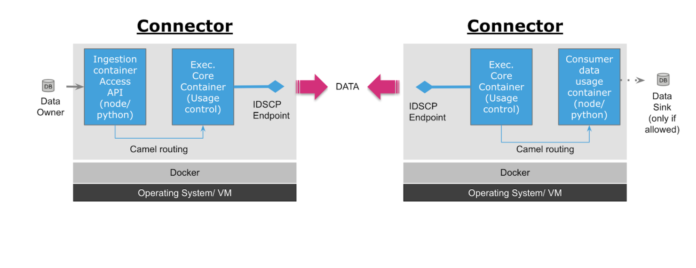
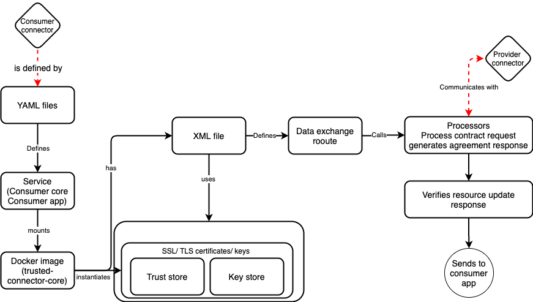

# Overview
This project is a reference implementation of farmstack to showcase restricting the usage of data by a specific node.js application. This reference implementation can be used to create usage policy classes that require constraining the usage of data for the specific purpose of the project and/or avoid unintended leak or misuse of data. Most of the data sharing agreements require that the data consumer use the data for that purpose for which data is being exchanged. This can be bundled as a specific node.js or python type application hosted on a container and the usage policy with p2p connectors can be used to restrict data usage beyond the container.

FarmStack consists of a p2p connector which is a fork from the [trusted connector](https://github.com/industrial-data-space/trusted-connector/) provided by IDSA - Fraunhofer. The p2p connectors manage docker containers and are assigned identities through which they can mutually authenticate each other and encrypt messages. IDSA also provides an IDS communication protocol which creates a secure web socket between connectors and acts as a remote attestation endpoint. The p2p connectors can be installed and run on premise by respective participants and used to provide data which can be accessed through file or API. The architecture laid down in the [IDSA reference architecture](https://www.internationaldataspaces.org/wp-content/uploads/2019/03/IDS-Reference-Architecture-Model-3.0.pdf) (published by Fraunhofer) is a message driven architecture which routes data using the open source [Apache Camel](https://camel.apache.org/docs/) framework. At the core of IDSA architecture is an [information model](https://github.com/International-Data-Spaces-Association/InformationModel) which provides the language independent description of digital resources (connectors, data description or any service etc). The information model is programmatically implemented in Java and the maven repositories are hosted in the public domain [here](https://jira.iais.fraunhofer.de/stash/projects/ICTSL/repos/ids-infomodel-demo/browse) by Fraunhofer IAIS. These classes are used to construct messages that are used to control the routing of data. The [message list](https://htmlpreview.github.io/?https://github.com/IndustrialDataSpace/InformationModel/blob/feature/message_taxonomy_description/model/communication/Message_Description.htm) of IDSA is given here. The high level abstraction of data sharing using connectors is shown below.

### Connector architecture details

## Implementation
In this reference implementation, there is one provider and one consumer, both running a FarmStack p2p connector. The connectors mutually authenticate and encrypt data through the SSL certificates provided to them from a simulated certificate authority. The provider configures a usage policy that refers to the hash of a container that can access data. The data provider has one sample csv file. The data consumer receives the data in IDS protocol (a secured web socket protocol developed by Fraunhofer). It has a node application running within the container of the p2p connector that renders and displays the data in html format (browser).
The usage policy essentially constrains that data be not used by any other container or if the container is modified. This is a basic example that can be used to create multiple usage restrictions that require data being available and used for only specific applications.

### Data provider side

## Data consumer side

### Code structure
Config/
 - Includes the configuration related files: 
    - Docker configuration for provider and consumer connectors (yaml files)
    - Data routing configurations of provider and consumer (xml files) 

Src/
 - Includes the demo nodejs application code

Cert stores/
 - Includes the certificate files issued by certificate authority

## To run connectors on single machine
 - To run provider node
    - change directory to IDSA-FS-DEMO/configs run $docker-compose -f docker-compose-provider.yaml up
 - To run the consumer node
    - Change directory to IDSA-FS-DEMO/configs run $docker-compose -f docker-compose-consumer.yaml up

## To run connectors separately on provider and consumer

 ### Add following lines in the respective files
        a. In the directory Configs/ add in the file docker-compose-provider.yaml following line in the provider-core docker service
        extra_hosts: - "consumer-core:your-consumer-machine-ip"

        b. In the directory Configs/ add in the file docker-compose-consumer.yaml following line in the consumer-core docker service
        extra_hosts: - "provider-core:your-provider-machine-ip"

## To test usage control(UC)
The current UC integration is provisioned to facilitate no-tampering in the running data-application consumer container using the digest(docker image’s id) which contains SHA256 hash, In case there is any change in the running data-application consumer container the image hash won’t match and the transfer would get rejected.

## Steps to prepare for UC integration :

Assuming we are in configs folder 
docker build ../src/consumer-apps/merge-csv-nodejs -t merge-csv-nodejs -q 
output - image-hash 
save merge-csv-nodejs > merge-csv-nodejs.tar 
docker load -i merge-csv-nodejs.tar 
docker tag image-hash merge-csv-nodejs 