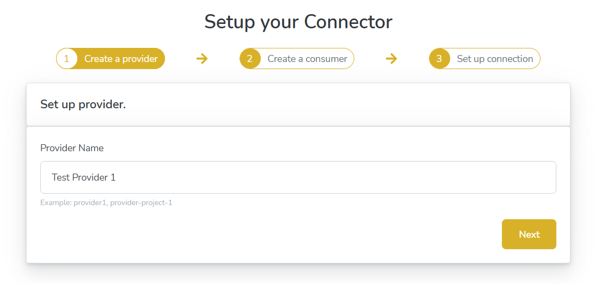
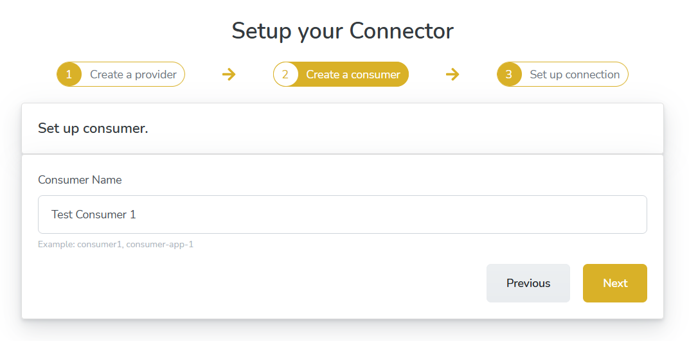
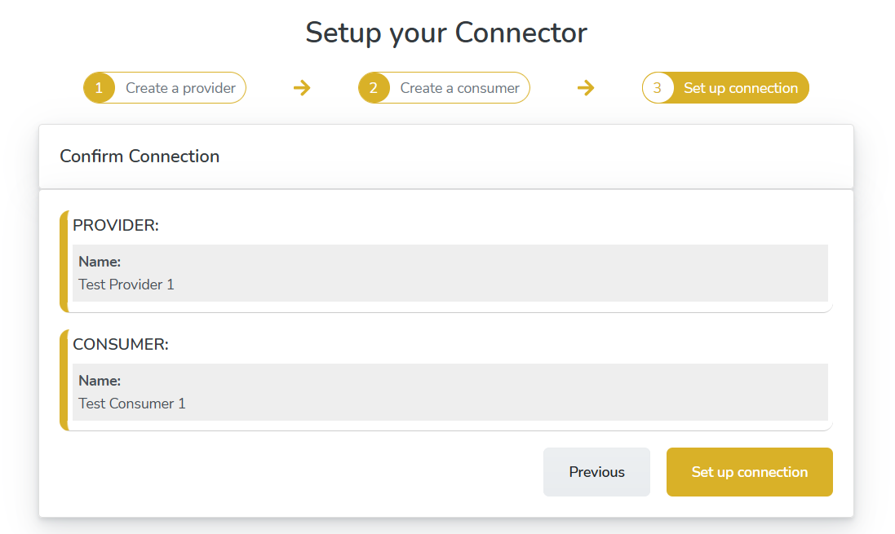
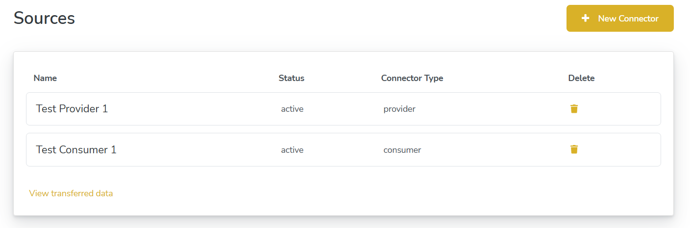
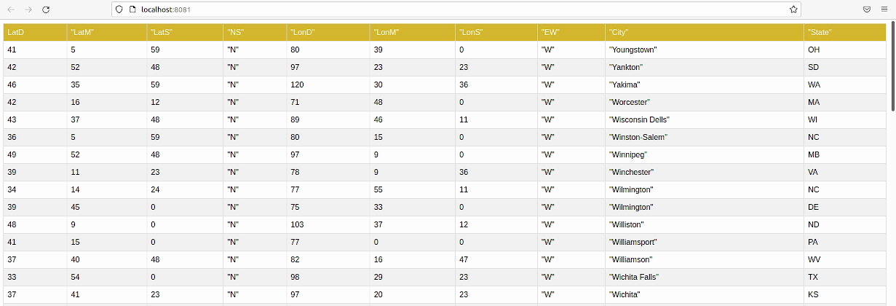

# Setting up Self-Managed Connectors

## Overview

This tutorial will guide you through the process of running an example self managed connector end-to-end setup. Kindly complete the prerequisites before following this guide.



## Setting up FarmStack connector

In the terminal window type the following command to run FarmStack setup:

```text
python3 setup.py
```

After the setup is complete, in the browser window, open the installer frontend by typing [http://localhost:8000](http://localhost:8000).

## Running example connectors

Navigate to New Connector tab

Give the provider a unique name, for example, `Test Provider 1` and click `Next`



Give the consumer a unique name, for example, `Test Consumer 1` and click `Next`



Verify the details and start the connection by clicking `Set up Connection` button.



Depending on your system resources and internet speed this step could take anywhere from a few seconds to a few minutes. You can check the progress in the terminal window.

When the connector setup is complete, open the status tab and click `View transferred data` link to see your data.




Kindly wait a couple of minutes for the contract negotiation process of provider and consumer to complete before they can start sharing the data. 

After the negotiation, the provider will start streaming data to the consumer. Kindly refresh to see the data shared into the consumer application.



This completes the tutorial for Setting up a Managed connector with usage control example. If you face any issue while running the self managed connector, kindly open a new issue in the Github repository and our experts will guide you.

