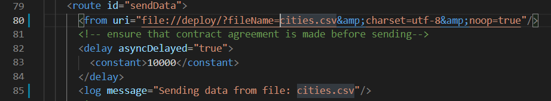
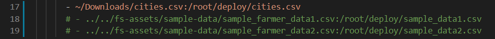

# Configuring a connector with CSV

## Overview

This tutorial will describe how to setup FarmStack connector for local csv files. Kindly follow the steps to install FarmStack requirements before proceeding with this setup.

## Local CSV file

You can follow this process for any file, here we will be using a file called cities.csv present in Downloads directory in home folder.

Clone the FarmStack Github repository on your local machine and open it.

```
git clone https://github.com/digitalgreenorg/farmstack-open.git
cd farmstack-open
```

In the FarmStack repository, open  `example-provide-routes.yaml` file in `fs-config/usage-control-example/` directory.

```
code fs-configs/usage-control-example/example-provider-routes.xml
```

In the route `sendData`, replace `sample_data1.csv` with filename of your CSV file.



Next, open `docker-compose-provider.yaml` file in `fs-config/usage-control-example/` directory.

```
code fs-configs/usage-control-example/docker-compose-provider.yaml
```

Here comment out the lines which mount `sample_data1.csv` and __ `sample_data2.csv` to the docker container, and add the line to mount the `cities.csv` to the container, as shown here:



There is no limit on the number of CSV files that can be mounted on connector, follow the same instructions for more csv files.

Save the files and in the terminal window type the following command to run FarmStack setup:

```
python3 setup.py
```

After the setup is complete, in the browser window, open the installer frontend by typing [localhost:8000](http://localhost:8000).

Follow the steps to create your connectors, give a unique name to your connectors such as cities-provider and cities-consumer.

Start the connection by clicking Setup Connection Button.

When the connector setup is done click View transferred data link to see your data. Kindly wait a couple of minutes for the contract negotiation process of provider and consumer to complete before they can start sharing the data.

## Online CSV file

Watch this space for super exciting updates. Our bots are already hard at work to create this page for you.

## Next Steps

This completes the tutorial for CSV file transfer through FarmStack Provider Connector. If you face any issue while setting up your own csv file kindly open a new issue in the github repository and our experts will guide you.
